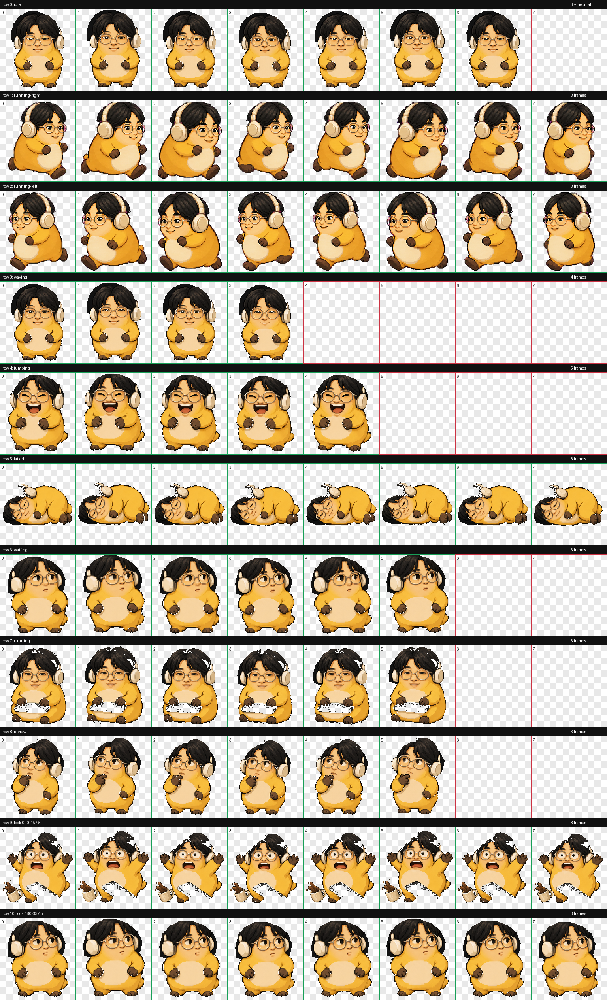

# HJJ — Codex 桌宠

HJJ 是一个适用于 Codex Desktop 自定义宠物功能的非官方社区桌宠。它是静态宠物资源，不需要后台程序、网络连接或额外 API。

## 安装

### Windows

在仓库根目录打开 PowerShell：

    powershell -ExecutionPolicy Bypass -File .\install.ps1

### macOS / Linux

    chmod +x ./install.sh
    ./install.sh

安装脚本会把 [pet/hjj/](pet/hjj/) 中的两个运行文件复制到 $CODEX_HOME/pets/hjj；如果没有设置 CODEX_HOME，则使用默认的 ~/.codex/pets/hjj。若目标中已有不同版本，脚本会先把旧目录备份到 pet-backups/，不会删除其他桌宠。

安装后重新打开 Codex，或在 Pets 设置中刷新，然后选择 **HJJ**。

### 手动安装

将 pet/hjj/ 整个目录复制到 Codex 自定义宠物目录：

    $CODEX_HOME/pets/hjj/
    ├── pet.json
    └── spritesheet.webp

仅需这两个文件即可使用。请保持文件名不变，并让它们位于同一个 hjj 目录中。

## 资源规格

- Codex 自定义宠物 v2
- 8 列 × 11 行，单格 192 × 208 像素
- 精灵图 1536 × 2288，RGBA WebP
- 含 9 个标准动画状态和 16 个视线方向
- 当前图集校验报告见 verification/

## 源码与构建

scripts/ 中有 Python/Pillow 图集构建工具；它们不是桌宠运行时依赖。安装 HJJ 不需要 Python。构建参数详见 [scripts/README.md](scripts/README.md)。

    python -m pip install -r scripts/requirements.txt
    python scripts/hjj_pet_builder.py --help
    python scripts/hjj_fused_running_builder.py --help

构建器需要源图像作为输入：基础构建器需要 HJJ 分镜图和 [Nai-wa 精灵图](third_party/nai-wa/spritesheet.webp)；融合跑步构建器还需要基础图集与 4×2 的跑步参考图。原始 HJJ 分镜图和中间生成提示没有随发布包提供；最终可安装图集已包含在 pet/hjj/ 中。上游 Nai-wa 素材的署名和许可见 [THIRD-PARTY-NOTICES.md](THIRD-PARTY-NOTICES.md)。

## 许可证

- Python 源码、安装脚本、配置和文档：[MIT](LICENSE)。
- HJJ 原创美术和改编图集：[CC BY 4.0](ASSET-LICENSE.md)。
- Nai-wa 上游素材：按其原有 CC BY 4.0 条款保留署名，见 [上游许可](third_party/nai-wa/ASSET-LICENSE.md)。

使用或改编美术时请保留署名、许可证链接并说明修改。第三方素材许可不代表获得其原型形象可能涉及的其他权利；详见第三方说明。

## 协作

欢迎通过 Issue 和 Pull Request 提交改进。请先阅读 [CONTRIBUTING.md](CONTRIBUTING.md)，尤其是代码与美术素材分别适用的许可证和第三方署名要求。

准备上传到 GitHub 时，可按 [PUBLISHING.md](PUBLISHING.md) 操作。

## 文件结构

    .
    ├── assets/                  # README 预览图
    ├── pet/hjj/                 # 可直接安装的桌宠资源
    ├── scripts/                 # Python 构建工具
    ├── third_party/nai-wa/      # 构建所需的上游参考图及原许可
    ├── verification/            # 图集校验记录
    ├── ASSET-LICENSE.md         # HJJ 美术许可
    ├── CONTRIBUTING.md
    ├── LICENSE                  # MIT（源码、安装脚本、文档与配置）
    ├── PUBLISHING.md            # 上传到 GitHub 的步骤
    ├── THIRD-PARTY-NOTICES.md
    ├── checksums.sha256
    ├── install.ps1
    └── install.sh
